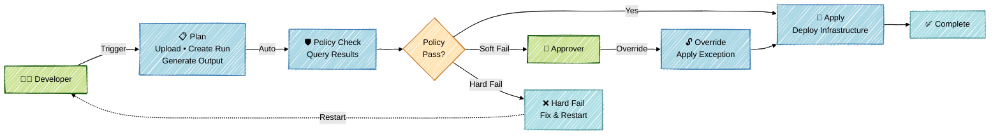

# IT Operations API Automation

This repository demonstrates **API-driven workflows** for Terraform using HCP Terraform and GitHub Actions. It showcases enterprise-grade infrastructure automation with policy governance, approval gates, and separation of duties.

## 🎯 Purpose

Demonstrate how API-driven workspaces enable:
- **Programmatic control** over infrastructure deployments
- **Policy enforcement** with Sentinel and approval workflows
- **Separation of duties** between developers and security approvers
- **Audit trails** through GitHub Actions and HCP Terraform integration
- **Custom CI/CD pipelines** that integrate Terraform with existing enterprise tools

## 🏗️ Architecture Overview

This demo uses a **multi-stage workflow** pattern where each stage is a separate GitHub Actions workflow:



## 📋 Workflows

### 1️⃣ Terraform Plan ([`1-terraform-plan.yml`](.github/workflows/1-terraform-plan.yml))

**Trigger**: Manual (`workflow_dispatch`) or Push to `main`

**What it does**:
1. ✅ Checks out Terraform configuration
2. ✅ Uploads configuration to HCP Terraform workspace
3. ✅ Checks for concurrent runs (prevents conflicts)
4. ✅ Creates a plan-only run via TFC API
5. ✅ Retrieves and displays plan output (add/change/destroy counts)
6. ✅ Uploads run details as artifact for downstream workflows

**Outputs**:
- `run_id` - HCP Terraform run ID for subsequent workflows
- `plan_id` - Plan ID for detailed inspection
- **Artifact**: `terraform-run-details` (JSON with run metadata)

**Key Actions Used**:
- `hashicorp/tfc-workflows-github/actions/upload-configuration`
- `hashicorp/tfc-workflows-github/actions/create-run`
- `hashicorp/tfc-workflows-github/actions/plan-output`

---

### 2️⃣ Sentinel Policy Check ([`2-sentinel-policy-check.yml`](.github/workflows/2-sentinel-policy-check.yml))

**Trigger**: Automatic after Workflow 1 completes (`workflow_run`)

**What it does**:
1. ✅ Downloads `run_id` from Workflow 1 artifact
2. ✅ Queries HCP Terraform for policy evaluation results
3. ✅ Displays failed policies (if any)
4. ✅ Determines if override is required
5. ✅ Waits for override or manual action (if soft-mandatory policies fail)

**Decision Logic**:
- **All policies pass** → Ready for Workflow 3 (Apply)
- **Soft-mandatory fail** → Awaits Workflow 2a (Override)
- **Hard-mandatory fail** → Workflow stops, code must be fixed

**Key Features**:
- Automatic policy evaluation without manual intervention
- Real-time status monitoring with 60-minute timeout
- Detects manual overrides applied via HCP Terraform UI
- Provides links to failed policies for review

---

### 2️⃣a Policy Override ([`2-a-policy-override.yml`](.github/workflows/2-a-policy-override.yml))

**Trigger**: Manual (`workflow_dispatch`) - Security Approver only

**Inputs Required**:
- `run_id` - The run awaiting override
- `justification` - Business justification for override

**What it does**:
1. ✅ Verifies run is in correct state (`post_plan_awaiting_decision`)
2. ✅ Retrieves and displays failed mandatory policies
3. ✅ Applies policy override via TFC API
4. ✅ Adds justification as comment (audit trail)
5. ✅ Confirms override success

**Security**:
- Requires `TF_API_APPROVAL_TOKEN` secret (separate from standard token)
- Should be restricted to security/compliance team via GitHub environment protection

---

### 3️⃣ Terraform Apply ([`3-terraform-apply.yml`](.github/workflows/3-terraform-apply.yml))

**Trigger**: Manual (`workflow_dispatch`)

**Inputs Required**:
- `run_id` - The run to apply (from Workflow 1)

**What it does**:
1. ✅ Verifies run is ready for apply
2. ✅ Confirms run status (planned, policy_override, or post_plan_completed)
3. ✅ Triggers apply via TFC API
4. ✅ Monitors apply progress
5. ✅ Reports success or failure

**Safety Checks**:
- Validates run hasn't been discarded
- Ensures policies are satisfied (passed or overridden)
- Provides link to HCP Terraform UI for real-time monitoring

**Key Actions Used**:
- `hashicorp/tfc-workflows-github/actions/apply-run`

---

## 🚀 Getting Started

### Prerequisites

1. **HCP Terraform Account** with workspace configured:
   - Execution mode: `remote`
   - Working directory: `./` (or your config path)
   - Sentinel policies configured (optional but recommended)

2. **GitHub Secrets** configured:
   - `TF_API_TOKEN` - Standard HCP Terraform API token (plan/apply permissions)
   - `TF_API_APPROVAL_TOKEN` - Elevated token for policy overrides (manage policy overrides permission)

3. **GitHub Variables** configured:
   - `TF_CLOUD_ORGANIZATION` - Your HCP Terraform organization name
   - `TF_WORKSPACE` - Workspace name (e.g., `it-ops-api-automation`)

### Running the Workflows

#### Happy Path (No Policy Failures)

```bash
# Step 1: Trigger plan workflow
# Actions → 1. Terraform Plan → Run workflow → Run

# Step 2: Wait for automatic policy check
# Workflow 2 triggers automatically and completes

# Step 3: Apply changes
# Actions → 3. Terraform Apply → Run workflow
# Input: run_id from Workflow 1 output
```

#### Policy Override Path (Soft-Mandatory Failure)

```bash
# Step 1: Trigger plan workflow
# Actions → 1. Terraform Plan → Run workflow → Run

# Step 2: Policy check detects failure
# Workflow 2 triggers automatically, waits for override

# Step 3: Security approver applies override
# Actions → 2a. Policy Override → Run workflow
# Inputs:
#   - run_id: <from Workflow 1>
#   - justification: "Approved by security team - ticket SEC-1234"

# Step 4: Apply changes
# Actions → 3. Terraform Apply → Run workflow
# Input: run_id from Workflow 1 output
```

---

## 🔐 Security & Governance

### Separation of Duties

| Role | Permissions | Actions |
|------|-------------|---------|
| **Developer** | Standard API token | Trigger Plan, Trigger Apply |
| **Security Approver** | Elevated API token | Override policies |
| **HCP Terraform** | Policy enforcement | Evaluate Sentinel policies |

### Audit Trail

Every action is logged:
- ✅ GitHub Actions run history (who triggered, when, inputs)
- ✅ HCP Terraform run history (plan details, apply results)
- ✅ Policy override justifications (comments in TFC)
- ✅ Artifacts stored for each workflow execution

### Policy Enforcement

Sentinel policies evaluate:
- **Cost thresholds** - Prevent runaway resource costs
- **Security rules** - Enforce encryption, network policies
- **Compliance checks** - Regulatory requirements
- **Naming conventions** - Organizational standards

---

## 📊 Workflow Details

### Workflow Communication

Workflows communicate via:
1. **GitHub Artifacts** - Pass `run_id` between workflows
2. **HCP Terraform API** - Query run status, policy results
3. **Workflow Outputs** - Job outputs available to downstream jobs

### Run ID Flow

```
Workflow 1 (Plan)
   ├─ Creates run in HCP Terraform
   ├─ Saves run_id to artifact
   └─ Outputs: run_id, plan_id

Workflow 2 (Policy Check)
   ├─ Downloads run_id artifact
   ├─ Queries TFC API for policy status
   └─ Waits for override (if needed)

Workflow 2a (Override - Optional)
   ├─ Uses run_id input
   ├─ Applies override via TFC API
   └─ Adds justification comment

Workflow 3 (Apply)
   ├─ Uses run_id input
   ├─ Verifies run status
   └─ Triggers apply via TFC API
```

### Error Handling

Each workflow includes:
- ✅ **Status validation** - Verify run state before actions
- ✅ **Timeout handling** - Maximum wait times for API operations
- ✅ **Error messages** - Clear failure reasons with remediation steps
- ✅ **Links to HCP Terraform UI** - Quick access for debugging

---

## 🛠️ Customization

### Adding Custom Validation

Insert steps in Workflow 1 before plan creation:

```yaml
- name: Run Security Scan
  run: |
    # Run Checkov, tfsec, or other tools
    checkov -d . --quiet --compact
```

### Integrating with ITSM

Add ServiceNow ticket creation in Workflow 2:

```yaml
- name: Create Change Ticket
  if: steps.check-policies.outputs.requires_override == 'true'
  run: |
    # Create ServiceNow change request
    curl -X POST "$SNOW_API/change_request" \
      -H "Authorization: Bearer $SNOW_TOKEN" \
      -d '{"short_description":"TFC Policy Override Required"}'
```

### Cost Estimation

Add Infracost integration in Workflow 1:

```yaml
- name: Calculate Infrastructure Cost
  uses: infracost/actions/setup@v2
  with:
    api-key: ${{ secrets.INFRACOST_API_KEY }}

- name: Generate Cost Estimate
  run: |
    infracost breakdown --path . \
      --format json \
      --out-file infracost.json
```

---

## 📚 Additional Resources

### HCP Terraform Documentation
- [API-Driven Workflows](https://developer.hashicorp.com/terraform/cloud-docs/run/api)
- [Sentinel Policies](https://developer.hashicorp.com/terraform/cloud-docs/policy-enforcement)
- [Run States & Transitions](https://developer.hashicorp.com/terraform/cloud-docs/run/states)

### GitHub Actions
- [tfc-workflows-github](https://github.com/hashicorp/tfc-workflows-github) - Official HashiCorp actions
- [Workflow Syntax](https://docs.github.com/en/actions/using-workflows/workflow-syntax-for-github-actions)
- [Artifacts](https://docs.github.com/en/actions/using-workflows/storing-workflow-data-as-artifacts)

### Related Projects
- [tfc-workflows-tooling](https://github.com/hashicorp/tfc-workflows-tooling) - TFCI container and CLI tools
- [terraform-best-practices](https://github.com/hashicorp/terraform-best-practices) - Module design patterns

---

## 🤝 Contributing

This is a demonstration repository. For production use:
- Review and customize policy requirements
- Implement organization-specific approval workflows
- Add comprehensive error handling
- Configure appropriate timeout values
- Set up monitoring and alerting

---

## 📝 License

This demonstration code is provided as-is for educational purposes.
